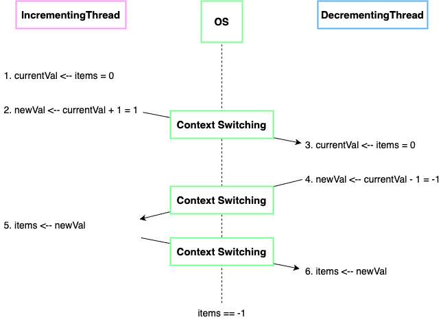

## 스레드 간 리소스 공유
### 리소스
> (컴퓨터 프로그램 영역에서) 데이터나 어떤 상태를 나타내는 것
- ex)
  - 변수
  - 데이터 구조 ex) array, collection, map, ...
  - 파일 / 네트워크나 데이터베이스 등의 커넥션
  - 메시지 큐
  - ...

스레드가 프로세스 내에서 공유할 수 있는 리소스는 힙에 저장되는 모든 데이터이다.

 

### 스레드 간 리소스를 공유했을 때의 장점
- 프로세스 내 자원들과 메모리를 공유하기 때문에 메모리 공간과 시스템 자원 소모가 줄어든다.
- 스레드 간 통신이 필요한 경우에도 쉽게 데이터를 주고 받을 수 있다.

  

## 원자적 연산
> 더 이상 쪼갤 수 없는 연산
- 중간에 어떤 방해도 받지 않고, 한 번에 수행되는 연산
- 완전히 처리했거나 아무것도 하지 않았거나, 두 가지 상황만 존재하는 연산

 

`i++` / `i--` 연산은 원자적 연산이 아니다.
1. 현재 메모리에 저장된 i의 값을 가져와서
2. 1을 더한 후에
3. 그 결과를 다시 i 변수에 저장

 

### 서로 다른 스레드가 공유한 리소스에 대해 비원자적 연산을 동시에 수행하는 경우 생기는 문제
(feat. RaceCondition.class 예제)

- 문제 원인
  - `i++` / `i--` 연산은 원자적 연산이 아니다.
  - 두 개의 스레드가 하나의 `InventoryCounter` 를 공유하고, 두 스레드 모두 `InventoryCounter` 를 읽고 수정할 수 있다.