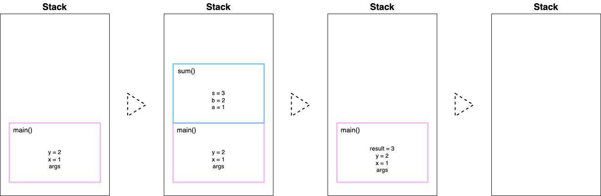
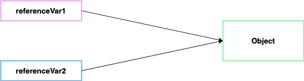

## Stack
- 메소드가 실행되는 메모리 영역
  
  -> 각 스레드 별로 할당되는 메모리 영역 
- 메소드에 입력된 모든 인수들이 스택에 할당된다.
- 메소드 내에 선언된 모든 로컬 변수도 스택에 할당된다.(primitive / reference 타입 상관없이)

    -> 스택과 명령어 포인터를 스레드의 전체적인 상태를 나타낸다고도 볼 수 있다.

```java

void main(String[] args) {
    int x = 1;
    int y = 2;
    int result = sum(x, y);
}

int sum(int a, int b) {
    int s = a + b;
    return s;
}

```


1. 스택 영역에 스택 프레임이 생성된다.
   - 스택 프레임
     > 스레드가 메소드를 실행하면 스택 영역에 실행한 메소드에 맞게 할당한 공간

2. 실행된 메소드 인수는 스택 영역에 할당된 메소드 프레임에 저장된다.
3. 메소드 내의 변수들도 생성된 순서대로 메소드 프레임에 저장된다.
4. 현재 실행되고 있는 메소드 내에서 다른 메소드를 호출한다면 새로운 스택 프레임이 현재 메소드의 스택 프레임 위에 할당된다.
   - 각 메소드는 각자의 프레임 내에 있는 변수에만 접근할 수 있다.
     
     -> sum() 는 main() 의 x, y를 알지 못하고 x, y의 복사본인 a, b에만 접근 가능하다.
5. sum() 의 실행이 끝나면 결과는 CPU 레지스터에 저장되고, sum() 에 할당된 스택 프레임도 없어진다.
6. main() 의 result 변수에 sum() 의 결과가 할당되어 스택 프레임에 저장된다.
7. main() 의 실행이 끝나면 main() 의 스택 프레임도 없어진다.

<br/>

위의 예제로 봤을 때 메소드가 실행될 때마다 각각 스택 프레임이 할당되며, 스택 프레임은 LIFO 특징을 가지고 있다.

스택에 입력된 모든 변수는 특정 스레드에 속하기에 다른 스레드는 이에 대해 접근할 수 없다.

스레드가 생성될 때 스택은 정적으로 할당되기 때문에 고정된 크기를 갖고, 중간에 크기를 변경할 수 없다.

또한 너무 많은 메서드를 중첩해서 호출하면 스택에 할당된 메모리가 빠르게 고갈되어 StackOverflow 예외가 발생할 가능성이 높다.
(재귀 메소드 실행 시 주의)

<br/><br/>

## Heap
- 프로세스에 속하는 공유 메모리 영역
- 모든 스레드는 힙 영역에 있는 모든 데이터를 공유한다.
- 모든 스레드는 힙 영역에 객체를 할당할 수 있고, 할당된 모든 객체들에 접근 가능하다.

<br/>

- 힙 영역에 저장되는 데이터
  - new 연산자로 생성되는 모든 객체 ex) String, Object, Collection, ...
  - 클래스 멤버 변수
  - 정적 변수

<br/>

힙은 JVM GC가 관리하고 통제한다.

객체는 참조하는 곳이 최소 한 곳이라고 있으면 계속해서 힙에 남아있고, 어디에서도 사용하지 않으면 GC가 해당 객체를 제거한다.

클래스 인스턴스 객체의 멤버 변수들은 부모 객체와 같은 수명 주기를 갖는다.

정적 변수는 애플리케이션이 실행되는 내내 힙 영역에서 제거되지 않는다.

<br/>

### Objects vs References
```java
Object referenceVar1 = new Object();
Object referenceVar2 = referenceVar1;
```
이 예제에서는 세 가지 데이터가 각각 메모리에 할당된다.
- new Object() -> 힙 영역
- referenceVar1 -> 스택 영역
- referenceVar2 -> 스택 영역



그리고 두 개의 레퍼런스 변수는 위의 그림과 같이 하나의 동일한 객체를 가르킨다.


<br/>

- Reference
  - 메소드의 로컬 변수로 선언되면 스택에 할당된다.
  - 클래스 멤버 변수로 선언되면 부모 객체와 함께 힙에 할당된다.
- Object
  - 항상 힙에 할당된다.